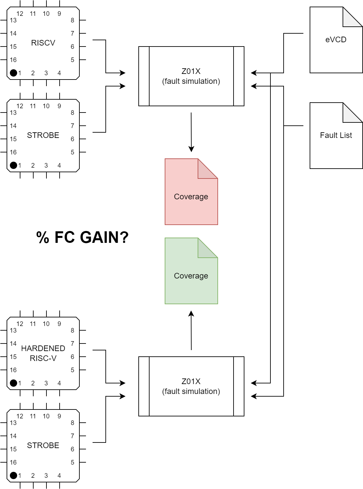

# Hardening of the Processor

Traditionally, as we saw in the course, during testing we are applying stimuli to a CUT and we are observing if any differences occur to the observable parts of the circuit, that they traditionally are its Primary and Pseudo-Primary Outputs. In an ad-hoc manner, we can create more test points in a circuit design (albeit costly) and/or we can multiplex signals with further logic that is destined to harden the core against e.g., permanent faults (stuck-at).

### Goal

Your goal in this assignment, is to initially evaluate a software test library (STL) under the stuck-at fault model using zoix and report the achieved fault coverage. Then, you have to modify the processor either in RT-Level or in Gate-Level and add your own logic in functional blocks of the processor with a goal to harden them. Obviously, if you choose to modify the RT-Level, the new Gate-Level of the core must be generated via logic synthesis. 

After modifying the core, you have to run a new fault simulation of the same STL and check whether you have managed to increase the fault coverage by considering your hardening modules as extra test points.

The flow of events is shown in the diagram below.

## Flow of Events

### (A) Baseline stuck-at simulation of the STL
Before making any change to the code, we have to run a fault simulation on a given STL program and store the computed coverage which will be used as a baseline in our comparissons later on. In this way we can clearly see which is the gain in terms of FC% as a result of the hardening. 

The fault simulation is based on an `eVCD` file which is used as a stimulus source, which must be generated from the logic simulation (in QustaSIM) of the Gate-level version of the unmodified core. When the simulation finishes, the `eVCD` dumpports file should be available under the `run` directory.

Note, that after the zoix fsim finishes, you have to move the generated fault lists and the coverage summaries OUT of the `run/zoix` directory and store them somewhere besides `ru/zoixn` (e.g., in a directory named `results`). This is because using the `make zoix` targets will erase in certain cases the zoix directory you have in order to populated with new sources and thus you will loose your data.

### (B.1) Modification of the processor in RT-Level

After analyzing the design and identifying the processor module you want to harden, you can choose to work on the RT-Level and perform changes on the souce code itself. In order to validate your code, you can always use the RT-Level logic simulation before moving to logic synthesis. However note that you have to modify the sources that the logic simulator (QuestaSIM) compiles before moving to the actuall shell/gui simulation. This can be done by inspecting the `Makefile` we provide you and by modifying the respective variables/sources to include also your new verilog/systemverilog files. 

It is advised to work in either verilog or systemverilog. In case you wish to work on VHDL further modifications need to be done to the `Makefile` (e.g., `vlog` -> `vcom`)

After you are sure that your modifications in RT-Level work, as the logic simulation works as expected you have to move to the logic-synthesis (`make synthesis`) and produce the new, hardened Gate-level description of the processor which will then you have to logic simulate again in order to see that everything works as expected as it did with the RT-Level. Obviously, if you have generated new files you have to modify the TCL script in `syn/bin/` to `analyze` your files too while parsing the design sources in order for your changes to be considered and thus reflected in the gate-level. 

### (B.2) Modification of the processor in Gate-Level

Alternatively, one may select a module and work directly on the gate-level version of the processor. In that case, you do not have to re-synthesize the processor but you have to be extra careful to validate your changes wiht regular logic simulations of the gate-level before moving to the next steps

### (C) Fault simulation of the hardened core

Once again, we resort to `zoix` to fault simulate our newly hardened core with the STL `eVCD` file we generated in step (A). The `strobe` file now (located under `zoix/`) must be modified in case you have added extra primary outputs to the processor and consider them too as strobe points. 

Before going to the fault simulation step it is **VERY IMPORTANT** and it is highly recommended to always run a `zoix/lsim` (logic simulation in zoix) to verify that your eVCD file does not have any missmatches. Specifically this message should always appear before you move on to the actual fault simulation step (`zoix/fsim`).

>`Info:    VCD stimulus completed with 0 mismatches.`

Never proceed to the fault simulation if you have missmatches in this step.

## Environment

Everything is orchestrated via the `Makefile` in the root directory of the environment. Use `make help` to see the available targets we have prepared for you. 

N.B.: 

1. The logic simulation should be done in functional mode hence you should compile the sources with `make questa/compile/functional`. This should be done just once (unless you `make clean` and the directory gets eliminated).

2. The fault simulation should be done in functional mode. This should be done just once (unless you `make clean` and the directory gets eliminated).

3. After each logic simulation in questasim, the eVCD file should be located in the directory `run/questasim`.

