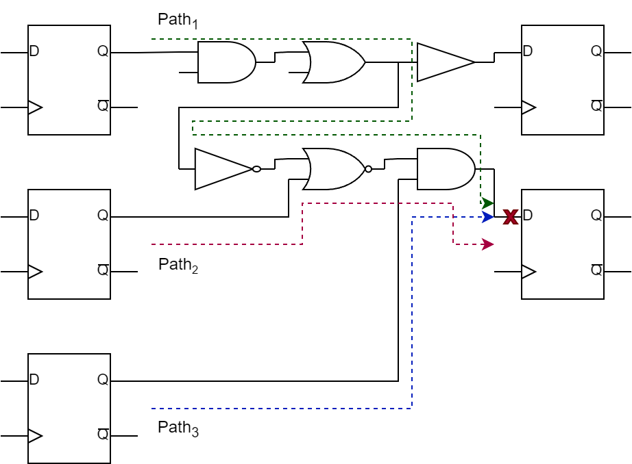
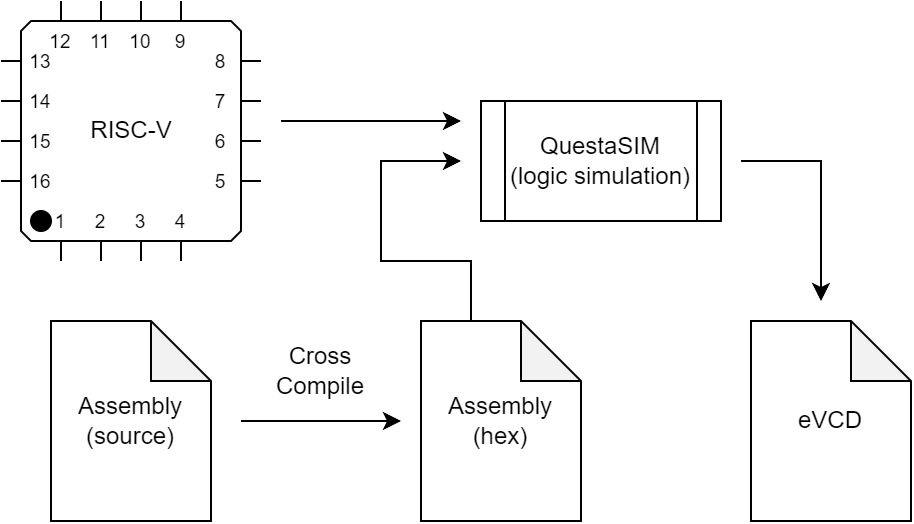
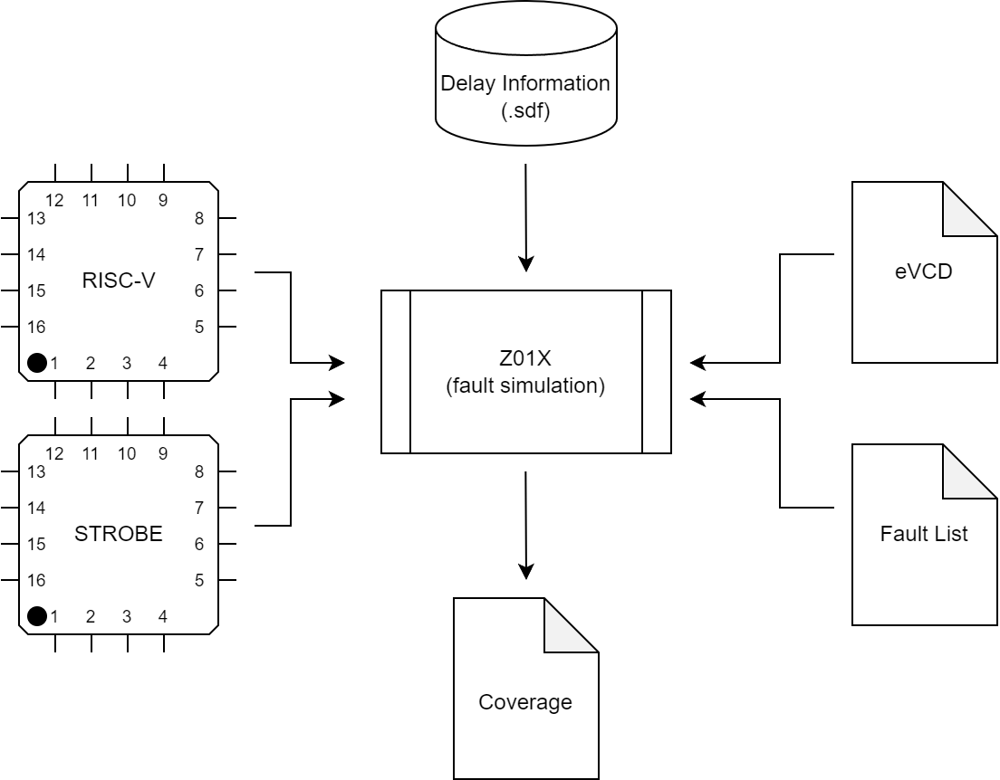

# Small Delay Defects and Functional Test

We have seen by now various testing flows and we extensively discussed the dominant fault models, stuck-at (sa) and transition delay faults (tdf). In class, we also spoke about small delay defects (sdd) which practically are defects with a size smaller than the system clock (in contrast to tdf), hence small-delay. This means that such delays are causing problems when considering the critical (or longest) propagation paths that they belong to. Their delay albeit small, when considering critical paths may be enough to cause an incorrect value to be latched which then can have severe consequences.

### But aren't TDFs covering also SDDs?

No. TDFs model the defect being present at an input/output port of a technology library cell. And each defect (slow-to-rise/str or slow-to-fall/stf) is already greater than the system clock period in contrast to SDDs. Furthermore, the ATPG algorithms for TDFs are optimized to propagate the fault-effect to an observation point through the **fastest path** available and **not** the critical path of the circuits. Hence SDDs are only covered by chance in this case and not systematically.

Example: Consider the following circuit 



TDF ATPG typically generates a pattern sequence that targets the fault along the path that has the largest timing slack, path 3. Notice this pattern sequence doesn’t cover smaller delay defects associated with path 1 and path 2 that would have been covered by targeting the path with smallest slack, path 1.

### SDD Aware Test

In order to systematically target the small delay defects, we need to incorporate in our test flow extra timing information to express the severity of each possible fault in the circuit timing-wise. This information is the product of the **Static Timing Analysis**. EDA tools such as Synposys PrimeTime are able to digest post-synthesis material (gate-level descriptions, .sdf files) and produce a global slack report for each port and pin of the circuit. 

# Assignment

Your goal is to produce functional stimuli (assembly program(s)) that target a **specific subset** of the small delay faults of the RISC-V processor you are given. 

You should find and report a 10-20% of CRITICAL SDDs that belong into a specific functional block of the processor and produce code that manages to successfully test them.

The GSF is given also in a CSV format for your convenience. So you can use an editor of your choice e.g., Excel to study it and perform an analysis on the functional block you intend to target. The fault site names indicate which is this functional block. 

For example, inside the file you should see something like:

```
/core/functional_block_a/UXX/Z,max_slack_rise,max_slack_fall
/core/functional_block_a/UXX/A,max_slack_rise,max_slack_fall
/core/functional_block_a/UXX/B,max_slack_rise,max_slack_fall
/core/functional_block_a/UXX/C,max_slack_rise,max_slack_fall
...
...
...
/core/functional_block_b/UXX/ZN,max_slack_rise,max_slack_fall
```
Find a set of critical slack values for e.g., `functinal_block_a`. Critical is considered the slack that has a small value, which means that the signal arrives pretty close to the circuits's hold time. Then try to undestand how you can sensitize these faults. For instance, if the `functional_block_a` is the multiplier, it should hint towards the usage of arithmetic and multiplication instructions and so on. After you analyze the faults, write RISC-V assembly (check the docs for the supported instructions and ISA extensions) which will be the stimulus source for the fault simulation.

## Flow of Events 

### (A) Validation of your Code & eVCD Generation

The first step after your analysis is to check your code for compliance with the ISA and the configuration of the processor. For this step we resport to functional logic simulation in the gate-level version of the processor in QuestaSIM. 



If for instance the code resorts to an endless loop in the shell (nogui) version of the simualation, you can launch a gui version and debug with the assistance of the waverforms until you produce something that works as intended and gracefully halts the core. Note, that during each logic simulation you are producing an eVCD file. On your golden simulation i.e., the one working as intended, this file will be the stimulus source for our fault simulation step.

### (B) SDD Fault List Generation 

With you having finalized during your analysis the faults you intend to target you can now proceed to generate the SDD fault list in standard synposys format (sff) for the fault simulation. The SDD fault list is generated in accordance with the GSF slack file that has been produced in PrimeTime. The GSF contains for each port and pin of the design the maximum slack. Hence, in compliance to this each port must be assigned a delay value. This value, assuming an arbitrary port **A** and its **slow-to-rise (STR)** fault is calculated as: 

$\text{delay}_A^{STR} = (\text{clock\_period}_{core} - \text{max\_slack}^{STR}_A) \times K $  

The same obviously holds for its counterpart slow-to-fall (STF). This fault list is generated with an in-house `python3` script that we have provided to you for your convenience.


⚠️ However in this step YOU have to define a parameter **K** which is a **float** multiplier. This multiplier augments the severity of the small delay fault. As the parameter increases with values $>> 1.0$ so do the probabilities of the fault to be detected with minimum effort since its effect is increasing. For example, a SDD fault generated with a parameter $K = 1.05$ has less probabilities of being detected with the SAME stimulus (assembly code) rather than the same SDD fault generated with a paraketer $K = 5.0$. 

Your goal is to find the sweet spot as a trade-off of Test application Time, K, and SDD coverage. So be very careful to select a "normal" value for this parameter during the fault list generation. It will be strongly taken into account for your overall evaluation. Do not exaggerate with very high values for $K$.

### (C) Fault Simulation

The final step is the fault simulation of your code (eVCD produced in step A). As a fault simulator we are going to use Z01X. 



Inspect the strobe file located in `zoix/` directory. This strobe file defines how the fault simulator should capture the responses of the Golden and the Faulty machine during the fault simulation. Furthermore, it explicitly defines which are the points to be captured i.e., the observation points of the circuit. These are the primary outputs of the processor core. 

The SDD fault simulation is known to last for **long times** as it is very computational intensive. So take this into consideration during your work. 

Before going to the fault simulation step it is **VERY IMPORTANT** and it is highly recommended to always run a `zoix/lsim` (logic simulation in zoix) to verify that your eVCD file does not have any missmatches. Specifically this message should always appear before you move on to the actual fault simulation step (`zoix/fsim`).

>`Info:    VCD stimulus completed with 0 mismatches.`


Never proceed to the fault simulation if you have missmatches in this step.

## Environment

Everything is orchestrated via the `Makefile` in the root directory of the environment. Use `make help` to see the available targets we have prepared for you. 


N.B.: 

1. The logic simulation should be done in functional mode hence you should compile the sources with `make questa/compile/functional`. This should be done just once (unless you `make clean` and the directory gets eliminated).

2. The fault simulation should be done in timing mode hence you should compile the soruces with `make zoix/compile/timing`. This should be done just once (unless you `make clean` and the directory gets eliminated).

3. After each logic simulation in questasim, the eVCD file should be located in the directory `run/questasim`.

